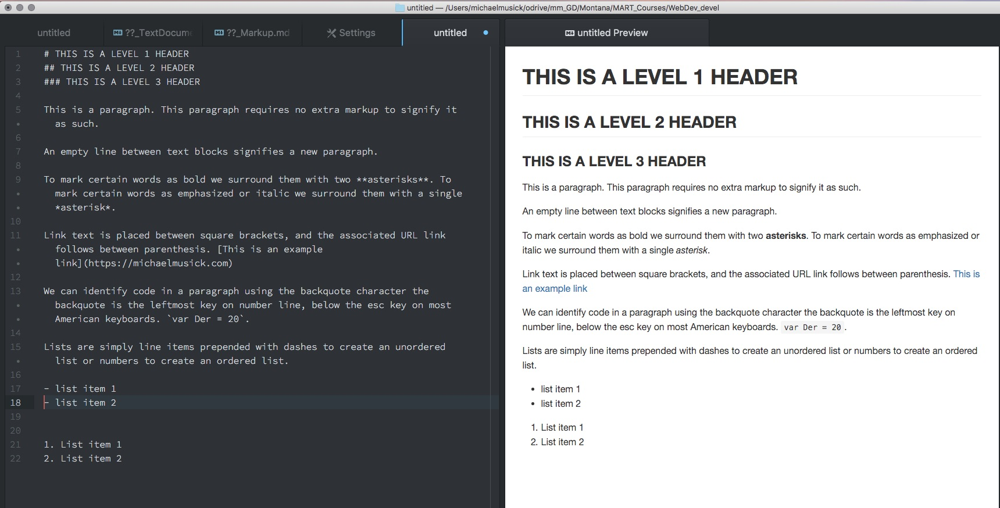

# Markup and the Markdown (`.md`) language.

A markup language is a system for annotating a document in a way that is syntactically distinguishable from the text.
Markup languages tend to encourage writers to focus on content and structure before concerning themselves with presentation.
Structure is defined for a processor through the use of tags embedded directly in the text.

One of the original markup languages, and one which you will be using extensively as a web developer is HTML or HyperText Markup Language. Although, we will wait until next week before we begin examining this specification. Instead, we are going to start with another, slightly simpler, and very popular markup language known as Markdown.

Just as HTML, markdown files encourage the writer to focus on content and structure, as opposed to formatting. In fact, this entire course has been initially written using markdown files. 

A markdown file typically uses the `.md` extension. This file type allows the writer to identify portions of the text as headers (at various levels), paragraphs, bold, italic, links, code, lists, and tables. It also allows the writer to easily include images through links in the document. Below is an example of markdown. There is also an image showing markdown text in the left of an Atom pane, and the markdown preview in the right Atom pane. 

```markdown
# THIS IS A LEVEL 1 HEADER
## THIS IS A LEVEL 2 HEADER 
### THIS IS A LEVEL 3 HEADER

This is a paragraph. This paragraph requires no extra markup to signify it as such. 

An empty line between text blocks signifies a new paragraph. 

To mark certain words as bold we surround them with two **asterisks**. To mark certain words as emphasized or italic we surround them with a single *asterisk*. 

Link text is placed between square brackets, and the associated URL link follows between parenthesis. [This is an example link](https://michaelmusick.com)

We can identify code in a paragraph using the back-tick character. The back-tick is the leftmost key on number line, below the esc key on most American keyboards. `var Der = 20`.

Lists are simply line items prepended with dashes to create an unordered list or numbers to create an ordered list.
- list item 1
- list item 2

1. List item 1
2. List item 2
```




## Markdown Cheat Sheet
There are many markdown resources to make writing markdown files easier. In Atom there are numerous markdown packages, such as markdown-writer, which allows you to call instructions from the command palette (Cmd + Shift + P). One great thing about Atom is that you can preview what the rendered text will look like by opening the command palette and pulling up the ‘markdown preview’. There are also specialized markdown writers such as [iA Writer](https://ia.net/writer) and Byword, both of which include tools to simplify the writing process and preview the file. 

These tools are all wonderful, and you may find them useful. But, what you need first, is a simple markdown cheat sheet, which tells you what symbols you need to use to specify structure and syntax. A google search will return a number of useful results.  However, I would suggest you start with the [GitHub cheat sheet](https://github.com/adam-p/markdown-here/wiki/Markdown-Cheatsheet).